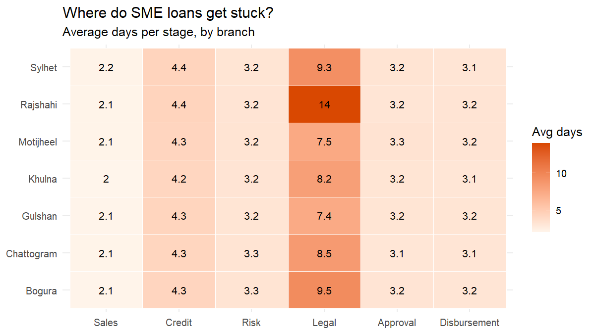
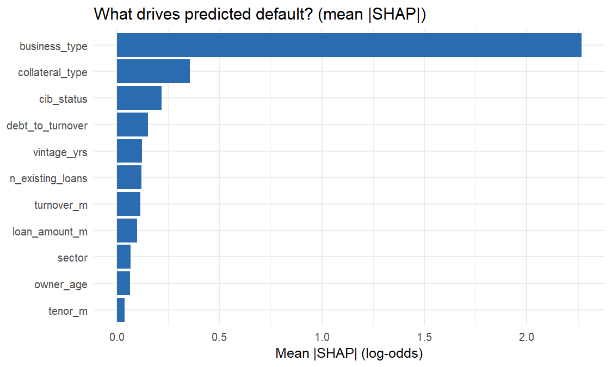
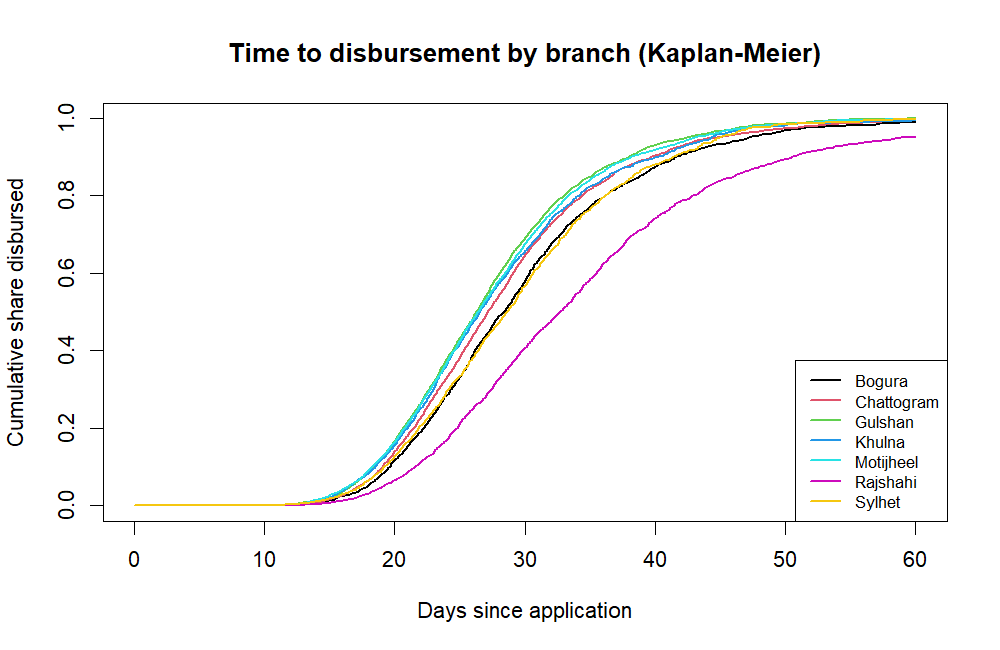

<div align="center">

# 🏦 CreditFlow
### SME Credit Analytics & Risk Intelligence Platform

<p>
  <b>Loan Pipeline Intelligence</b> ·
  <b>Credit Scoring</b> ·
  <b>Explainable AI</b> ·
  <b>Policy Simulation</b> ·
  <b>Expected Loss</b> ·
  <b>Model Monitoring</b>
</p>

<p>
  
  
  
  
  
</p>

<p>
  <a href="#-interactive-demo">🚀 Interactive Demo</a> ·
  <a href="#-what-creditflow-solves">🎯 What It Solves</a> ·
  <a href="#-analytics-showcase">📊 Analytics</a> ·
  <a href="#-technical-stack">🛠️ Tech Stack</a>
</p>

</div>

---

<div align="center">

> ### From loan pipeline data to risk-aware decision intelligence.
>
> **25,000 synthetic SME applications** analyzed through an end-to-end credit analytics workflow.

</div>

---

## 🚀 Interactive Demo

<div align="center">

### **Explore CreditFlow as a Product**

<a href="./CreditFlow-Interactive-Presentation.html">
  
</a>

<br><br>

<sub>Glassmorphism UI · Curved cards · Interactive navigation · Policy simulation · Dashboard previews</sub>

</div>

<br>

<table>
<tr>
<td width="50%" align="center">

### 📈 Management Intelligence

Loan movement, KPIs, TAT and operational bottlenecks.

</td>
<td width="50%" align="center">

### 🛡️ Credit Risk Intelligence

Scorecards, risk segmentation, explainability and monitoring.

</td>
</tr>
<tr>
<td width="50%" align="center">

### 🎛️ Policy Simulation

Explore score cut-off, approval, risk and exposure trade-offs.

</td>
<td width="50%" align="center">

### 🔎 Model Governance

AUC, KS, PSI, bad-rate and delayed-label monitoring concepts.

</td>
</tr>
</table>

---

# 🎯 What CreditFlow Solves

Most portfolio projects stop at:

```text
Dataset → Model → Accuracy
```

**CreditFlow goes further.**

```text
                    ┌──────────────────────┐
                    │   SME Loan Pipeline  │
                    └──────────┬───────────┘
                               ↓
                    ┌──────────────────────┐
                    │ Operational Analytics│
                    └──────────┬───────────┘
                               ↓
                    ┌──────────────────────┐
                    │ Bottleneck Detection │
                    └──────────┬───────────┘
                               ↓
                    ┌──────────────────────┐
                    │  Credit Scorecard    │
                    └──────────┬───────────┘
                               ↓
                    ┌──────────────────────┐
                    │ Explainable ML / SHAP│
                    └──────────┬───────────┘
                               ↓
                    ┌──────────────────────┐
                    │  Policy Simulation   │
                    └──────────┬───────────┘
                               ↓
                    ┌──────────────────────┐
                    │ Expected Loss / P&L  │
                    └──────────┬───────────┘
                               ↓
                    ┌──────────────────────┐
                    │ Model Monitoring     │
                    └──────────────────────┘
```

<table>
<tr>
<td align="center"><b>🏢 Operations</b><br><sub>Where are applications getting stuck?</sub></td>
<td align="center"><b>💳 Credit Risk</b><br><sub>Which applications carry higher risk?</sub></td>
<td align="center"><b>💰 Policy</b><br><sub>What changes when the cut-off changes?</sub></td>
<td align="center"><b>📡 Monitoring</b><br><sub>Is the model remaining stable?</sub></td>
</tr>
</table>

---

# 📊 Executive Dashboard

<div align="center">


</div>

<br>

<table>
<tr>
<td width="25%" align="center"><h3>25K</h3><sub>SME Applications</sub></td>
<td width="25%" align="center"><h3>6</h3><sub>Pipeline Stages</sub></td>
<td width="25%" align="center"><h3>TAT</h3><sub>Turnaround Analysis</sub></td>
<td width="25%" align="center"><h3>Risk</h3><sub>Credit Intelligence</sub></td>
</tr>
</table>

<details>
<summary><b>🔍 What this view tells management</b></summary>

<br>

- Application volume and movement
- Disbursement performance
- Turnaround time
- Stuck applications
- Pipeline funnel
- Stage-level processing behavior

</details>

---

# 🔄 SME Loan Pipeline Intelligence

<div align="center">


</div>

<br>

<div align="center">

`Sales` → `Credit` → `Risk` → `Legal` → `Approval` → `Disbursement`

</div>

The platform tracks movement between functional departments and analyzes where processing time accumulates.

### 🧭 Branch × Stage Bottleneck Detection

<div align="center">



</div>

> **Operational question:** Which branch and processing stage is creating the largest waiting-time bottleneck?

---

# 🛡️ Credit Risk Intelligence

<div align="center">


</div>

<br>

<table>
<tr>
<td align="center">📐<br><b>WOE / IV</b><br><sub>Variable transformation & selection</sub></td>
<td align="center">📊<br><b>Scorecard</b><br><sub>Logistic regression</sub></td>
<td align="center">🌲<br><b>ML Benchmarking</b><br><sub>RF + XGBoost</sub></td>
<td align="center">🧠<br><b>Explainability</b><br><sub>SHAP + reason codes</sub></td>
</tr>
</table>

---

# 🧠 Explainable AI

<div align="center">



</div>

### Why SHAP?

The project does not treat a prediction as a black box.

SHAP-based analysis is used to investigate:

```text
Model Prediction
      ↓
Feature Contribution
      ↓
Risk Driver
      ↓
Interpretable Explanation
```

This supports model interpretation and the development of credit-officer-readable reason codes.

---

# 🎛️ Credit Policy Simulator

<div align="center">

### Score Cut-off → Approval → Risk → Exposure → Expected Loss

</div>

<table>
<tr>
<td width="50%" valign="top">

### 🎚️ Policy Lever

**Score Cut-off**

Adjust the credit score threshold to explore an illustrative policy scenario.

</td>
<td width="50%" valign="top">

### 📌 Decision Signals

- Approval Rate
- Bad Rate
- Approved Exposure
- Expected Loss
- Net Income After EL

</td>
</tr>
</table>

<div align="center">

**The interactive presentation contains a live demonstration of this relationship.**

<br>

<a href="./CreditFlow-Interactive-Presentation.html">
  
</a>

</div>

> **Important:** The presentation simulator is an illustrative demonstration. Production decisions should use the underlying Shiny application and validated model outputs.

---

# 💰 Expected Loss Framework

<div align="center">

<table>
<tr>
<td align="center"><h2>PD</h2><sub>Probability<br>of Default</sub></td>
<td align="center"><h2>×</h2></td>
<td align="center"><h2>LGD</h2><sub>Loss Given<br>Default</sub></td>
<td align="center"><h2>×</h2></td>
<td align="center"><h2>EAD</h2><sub>Exposure at<br>Default</sub></td>
<td align="center"><h2>=</h2></td>
<td align="center"><h2>EL</h2><sub>Expected<br>Loss</sub></td>
</tr>
</table>

</div>

CreditFlow connects predicted risk with portfolio-level financial interpretation:

```text
Approved Exposure
        ↓
Probability of Default
        ↓
Expected Loss
        ↓
Net Income After Expected Loss
```

This creates a bridge between **model output and business impact**.

---

# ⏱️ Time-to-Disbursement Analytics

<div align="center">



</div>

Kaplan-Meier analysis provides a survival-style view of how quickly applications reach disbursement.

### Analytical focus

- Time-to-event behavior
- Branch-level differences
- Median time-to-disbursement
- Unresolved applications during observation

---

# 📡 Model Monitoring

<div align="center">


</div>

<table>
<tr>
<td align="center"><h3>AUC</h3><sub>Discrimination</sub></td>
<td align="center"><h3>KS</h3><sub>Class separation</sub></td>
<td align="center"><h3>PSI</h3><sub>Population stability</sub></td>
<td align="center"><h3>Bad Rate</h3><sub>Portfolio outcome</sub></td>
</tr>
</table>

### 🔁 Monitoring Lifecycle

```text
Train
  ↓
Validate
  ↓
Out-of-Time Test
  ↓
Deploy
  ↓
Monitor AUC / KS / PSI / Bad Rate
  ↓
Investigate Drift & Outcome Changes
```

The project also considers delayed outcome labels, reflecting the practical reality that loan performance outcomes may become observable after a time lag.

---

# 🧪 Credit Modeling Workflow

<div align="center">

| Stage | Method |
|:---:|---|
| 01 | Data Preparation |
| 02 | Exploratory & Operational Analytics |
| 03 | Variable Binning |
| 04 | WOE / IV |
| 05 | Logistic Scorecard |
| 06 | Random Forest / XGBoost Benchmark |
| 07 | AUC / KS Evaluation |
| 08 | SHAP Explainability |
| 09 | Out-of-Time Validation |
| 10 | PSI / Monthly Monitoring |

</div>

---

# 🗃️ Data

### Dataset Scale

<table>
<tr>
<td align="center"><h2>25,000</h2><sub>SME loan applications</sub></td>
<td align="center"><h2>6</h2><sub>functional stages</sub></td>
<td align="center"><h2>Monthly</h2><sub>monitoring structure</sub></td>
</tr>
</table>

### Data Transparency

> 🔒 The dataset is **synthetic** and is used for portfolio demonstration. It does not represent confidential customer or banking data.

The purpose is to demonstrate the **analytical architecture, modeling workflow and decision-support design**, not to reproduce a real institution's portfolio.

---

# 🛠️ Technical Stack

<div align="center">

<table>
<tr>
<td align="center" width="25%">

### 📊 Analytics
R<br>
dplyr<br>
ggplot2

</td>
<td align="center" width="25%">

### 🖥️ Application
Shiny<br>
HTML / CSS<br>
Interactive UI

</td>
<td align="center" width="25%">

### 🗄️ Data
SQL<br>
SQLite<br>
DBI / RSQLite

</td>
<td align="center" width="25%">

### 🤖 ML
Logistic Regression<br>
Random Forest<br>
XGBoost

</td>
</tr>
</table>

</div>

---

# 📁 Project Architecture

```text
CreditFlow-SME-Credit-Analytics/
│
├── app.R
│
├── data/
│   ├── raw/
│   └── processed/
│
├── outputs/
│   ├── shap_importance.png
│   ├── bottleneck_heatmap.png
│   ├── km_time_to_disbursement.png
│   ├── monitoring_monthly.csv
│   ├── scorecard_points_table.csv
│   └── ...
│
├── screenshots/
│   ├── Management View_one.png
│   ├── Management View_two.png
│   ├── Risk View_one.png
│   └── Risk View_two.png
│
├── sql/
│   └── ...
│
├── CreditFlow-Interactive-Presentation.html
├── deploy.R
├── DEPLOY.md
└── README.md
```

---

# ▶️ Run Locally

### 1. Clone

```bash
git clone https://github.com/Saikot313/CreditFlow-SME-Credit-Analytics.git
cd CreditFlow-SME-Credit-Analytics
```

### 2. Install required R packages

```r
install.packages(c(
  "shiny",
  "DBI",
  "RSQLite",
  "dplyr",
  "ggplot2",
  "data.table",
  "xgboost",
  "randomForest"
))
```

### 3. Launch

```r
shiny::runApp()
```

Then open the local Shiny URL displayed by R.

---

# 🎥 Presentation Mode

Want to understand the project without reading the entire source code?

<div align="center">

<a href="./CreditFlow-Interactive-Presentation.html">

</a>

<br><br>

<sub>Designed as a recruiter-friendly product walkthrough.</sub>

</div>

---

# 🔮 Future Extensions

<table>
<tr>
<td>🗄️ PostgreSQL</td>
<td>⚙️ Automated ETL</td>
<td>🚨 Monitoring Alerts</td>
</tr>
<tr>
<td>☁️ Production Deployment</td>
<td>🔐 Role-Based Access</td>
<td>🔁 Champion / Challenger</td>
</tr>
</table>

---

# 👨‍💻 Author

<div align="center">

### Md. Sakender Saikot

**MSc in Computer Science — Major in Data Science**  
American International University-Bangladesh (AIUB)

**BSc in Computer Science & Engineering**  
Varendra University

<br>

`Data Science` · `Machine Learning` · `Credit Risk Analytics` · `Explainable AI` · `MLOps`

<br>

<a href="https://github.com/Saikot313">

</a>

</div>

---

<div align="center">

### ⭐ If you find this project useful, consider starring the repository.

<br>

**CreditFlow**  
<sub>Turning SME lending data into operational and risk intelligence.</sub>

</div>
